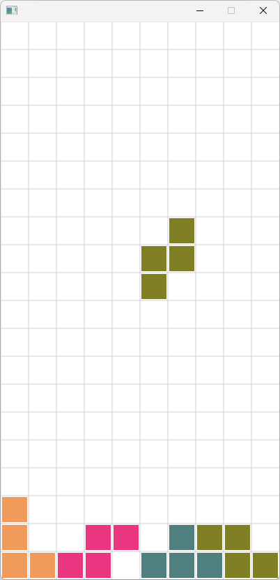

# Tetris 
## Introduction:
This is a simple Tetris game I built for fun. Just to practice the use of KeyFrame, TimeLine and enum class in JavaFX.  
It's incompleted, blocks can not be cleared and no collision detection.  

Find the executable application (number_guessing-fx.exe) from Google Drive:  
[Edmond's Java Program Collection.zip (Windows)](https://drive.google.com/file/d/1ve7sEscvtVldRKZU-B3VhaQdORteksQk/view?usp=drive_link)

## Snapshot
 

## Hot Keys
**Left/Right**: move left or right  
**Space**: rotate  
**Down**: drop instantly

## Features
- Blocks rotate in clockwise
- Foldable setting panel.

## Tech Stack 
| Type | Name |
| ----------- | ----------- 
| Programming Language | Java |
| GUI Library | Java FX |
| GUI Tool | Scene Builder|

## Run Instruction
### Requirement:
- Java Runtime Environment
- Java FX
### Steps:   
To run the application in your local machine, please follow the steps below:
1. Clone the repository from the github  
2. Add JavaFX to Build Path
3. Add the VM argrements to the run configure:  
`--module-path "<PATH TO YOUR JavaFX/lib>" --add-modules javafx.controls,javafx.fxml`
4. Run the *TetrisFx_Main.java* in the *application* package.

## License
MIT